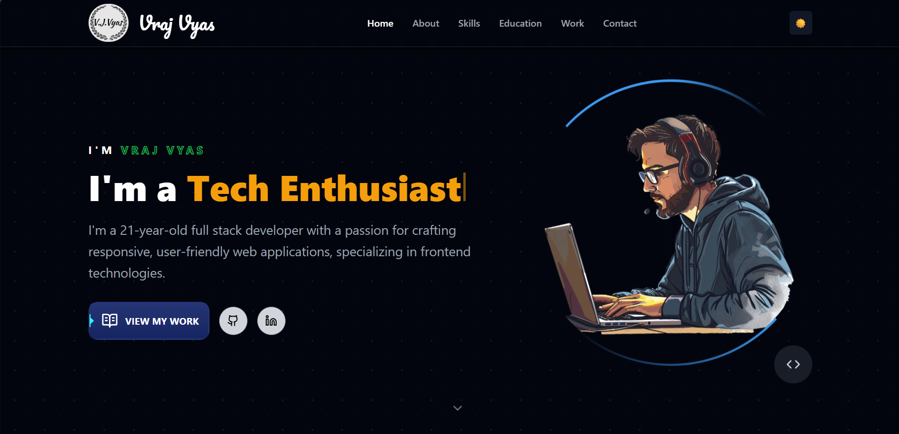
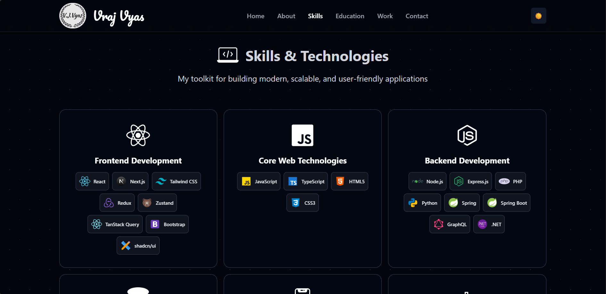
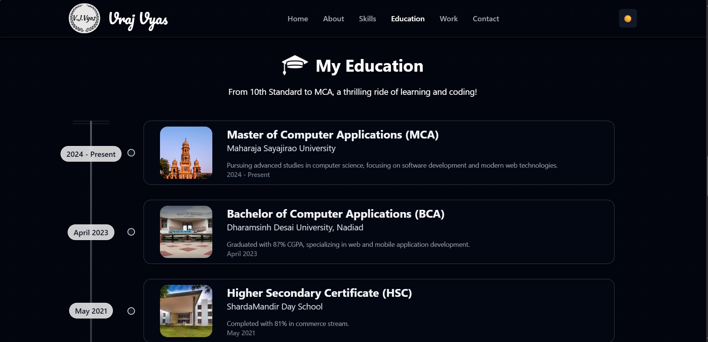
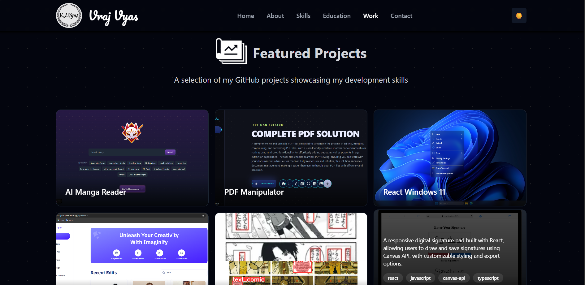
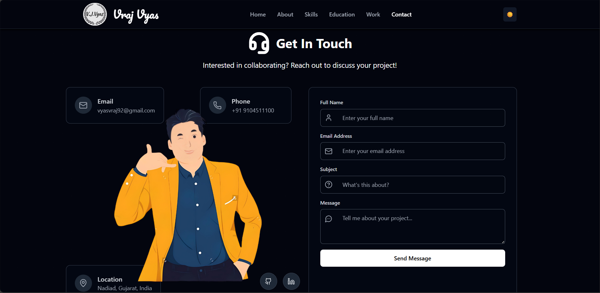
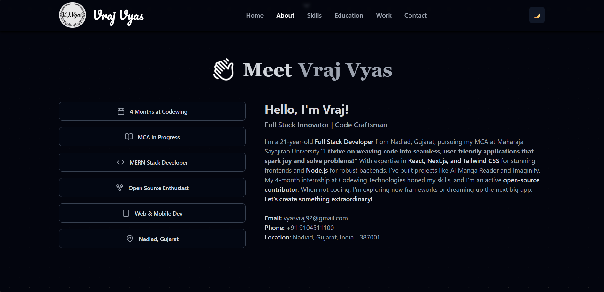

# Vraj Vyas Portfolio Website

Welcome to my personal portfolio website showcasing my skills, projects, and experience as a Full Stack Developer.

[Live Demo](https://vrajvyasportfolio.vercel.app)

---

## About

This portfolio is built with React and Tailwind CSS, featuring a clean, modern design with dark mode support, smooth animations, and responsive layouts for all devices.

I specialize in crafting responsive, user-friendly web applications with a focus on frontend technologies, while also having strong backend skills.

---

## Features

- Dark mode toggle with smooth color transitions
- Animated hero section with dynamic role typing effect
- Responsive design optimized for mobile and desktop
- Interactive skills and projects sections with hover effects
- Contact form with validation and social links
- Education timeline with clean, modern UI
- Smooth scrolling navigation and section highlighting

---

## Tech Stack

- **React** — Frontend UI library
- **Tailwind CSS** — Utility-first CSS framework for styling
- **Vite** — Fast build tool and development server
- **Lucide Icons** — Open-source icon library
- **JavaScript (ES6+)** — Modern JavaScript features
- **React Hooks** — State and lifecycle management
- **Intersection Observer API** — Scroll animations

---

## Screenshots

Here are some screenshots of the portfolio website:

|  |  |  |
|:------------------------------:|:------------------------------:|:------------------------------:|
|          Home Section           |          About Section          |         Skills Section          |

|  |  |  |
|:----------------------------------:|:------------------------------:|:-------------------------------:|
|         Education Section          |          Work Section           |         Contact Section          |

---

## How to Run Locally

1. Clone the repository:

   ```bash
   git clone https://github.com/VrajVyas11/VrajVyas_Portfolio.git
   cd VrajVyas_Portfolio

2.
Install dependencies:
 ```bash
	npm install
```

3. 
Start the development server:
```bash
	npm run dev
```

4. 
Open your browser and navigate to
```bash
 http://localhost:3000
```


---

License

This project is licensed under the MIT License.

---

Connect with Me

- GitHub
- LinkedIn
- Portfolio Live Demo

---

Thank you for visiting my portfolio!
